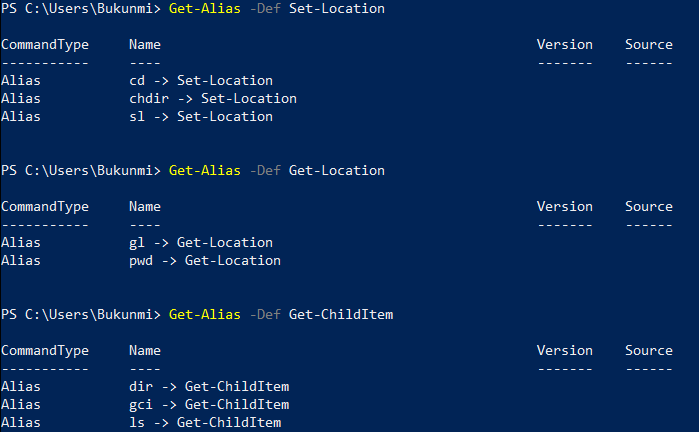

# Powershell CLI


Module: **OS Administration** </br>
Competency: Able to use the Powershell CLI for common tasks </br>
Participant(s): **solo** </br>


## The Mission

You already had the opportunity to learn and use the Bash shell, but there are many other shells one could use. They all have their specificities, strengths and weaknesses; although they all work in similar manner they all answer to specific needs. One could says that knowing a new shell is like having a new tool in your toolset, this challenge will have you add [Powershell](https://en.wikipedia.org/wiki/PowerShell) to it.

Powershell is one of the **most common shells** in modern **Windows systems**, it has a different approach to Bash in that it manipulates [data types](https://docs.microsoft.com/en-us/powershell/scripting/lang-spec/chapter-04?view=powershell-7.1) instead of exclusively text I/O (_input/output_). Furthermore, since it's developped by Microsoft it's also deeply integrated into Windows enebling extensive Windows system configuration.


## Powershell Manual
`Get-Help` <command> -To get help <br>
`Get-Help -<command> -Online` -creates online help window through default browser

## Powershell Commands:
Powershell primarily operates using cmdlets. Cmdlets (short for command-let) are lightweight, verb-noun convention commands that are used to perform tasks. Examples: `Set-Location`, `Get-Location`, `Get-ChildItem`. #

These commands however have corresponding aliases which are much shorter. To obtain this, use `Get-Alias -Definition <command>` command:




## Powershell Navigation

Move around in the filesystem with `Set-Location`, `Get-Location`, `Get-ChildItem`:

- Print your current location on the screen: `Get-Location` or `pwd`
- Print the content of your current directory: `Get-childItem` or `ls`
- Print the content of your root : `Get-childItem -Path C:\` or `ls C:\`
- Go into your home folder : `Set-Location -Path C:\Users\Username` or `pwd ~`
- Print the content of your home: `Get-childItem -Path C:\Users\Username` or `ls ~`

## Powershell File Operations

Manipulate files and folders. Use the commands `Get-Content`, `echo`, `New-Item`, `Move-Item`, `Copy-Item`, and `Remove-Item`.

- Create a file named story1.txt: 
```sh
ni -type f story1.txt
```
- Create content in the file: 
```sh
echo "Hello World" > story1.txt
```
- Print the content of the file: 
```sh
ls story1.txt
```  
- Create a folder named `story`: 
```sh
ni -type dir story
```
- Move `story1.txt` inside `story`: 
```sh
mv story1.txt story`
```
- Copy `story1.txt` as `story2.txt`: 
```sh
cp .\story\story1.txt story2.txt
```
- Print file content: 
```sh
gc .\story\story1.txt
```
- Rename `story2.txt` as `me.txt`: 
```sh
ren .\story\story2.txt me.txt
```
- Append `me.txt` and add "I am a junior at Becode": 
```sh
ac -Path "me.txt" -Value "I am a junior at Becode"
```
Alternatively you may use the default text editor on your pc. Unlike Linux, there are no in-built text editor in Powershell.
```sh
Start "me.txt"
#edit the file
```
- Remove the folder story with it's content
```sh
rm -Path ".\story" -Recurse
```

## Powershell Permissions

Now that we can navigate and create files, we should be able to change permissions on these. We will use the commands `Get-Acl`, `Set-Acl`, `RunAs`

- Create a file
```sh
ni -type f new_file.txt
```
- Check the owner and the groups
```sh
Get-Acl new_file.txt | select Owner, Group
```

- Change the file owner to the built-in administrator (administrator account is disabled by default, check how to enable it. Don't forget to set a strong password!)
```sh
#switch to admin account window
Start-Process powershell -Verb RunAs

#enable built-in administrator account
net user administrator /active:yes

#set password
net user administrator <password>

#change the file ownership to administrator
takeown /f "C:\Users\Username\new_file.txt"

#grant full permission
icacls "C:\Users\Username\new_file.txt" /grant Administrators:F
```
- Check the file's permission
```sh
Get-Acl -Path "C:\Users\Username\new_file.txt" | Select Access
```
- Try to print the content of the file as your normal user:

```sh
PS C:\Users\Username> gc .\new_file.txt

gc : Access to the path '.\new_file.txt' is denied.
At line:1 char:1
+ gc new_file.txt
+ ~~~~~~~~~~~~~~~
    + CategoryInfo          : PermissionDenied: (C:\Users\Username\new_fil
   e.txt:String) [Get-Content], UnauthorizedAccessException
```

- Print the content of the file using administrator account:
```sh
PS C:\WINDOWS\system32> gc C:\Users\Username\new_file.txt

This is a new file
```

> **WARNING**: This exercise **will only work on Windows** system since file system permissions are not managed the same way on Windows and Linux.


# Powershell Package Management

It's time to start installing softwares and keep them updated. We will see how to use Chocolatey and how to use Windows Updates.

* Instructions

- Get Windows updates
    - Install the `PSWindowsUpdate` module
```sh
Install-Module -Name PSWindowsUpdate -Force -Confirm:$false
```
    - Check for updates
```sh
Get-WindowsUpdate

```
    - Install updates
```sh
Install-WindowsUpdate -AcceptAll -AutoReboot
```
- Manage Packages
    - Install `Chocolatey`
```sh
# run with administrative privileges
Set-ExecutionPolicy Bypass -Scope Process -Force; [System.Net.ServicePointManager]::SecurityProtocol = [System.Net.ServicePointManager]::SecurityProtocol -bor 3072; iex ((New-Object System.Net.WebClient).DownloadString('https://chocolatey.org/install.ps1'))
``
    - Install `VLC` from `Chocolatey`
```sh
choco install vlc -y
```
    - Upgrade `VLC` to the latest version (it should already be but it's your first use)
```sh
choco upgrade vlc -y
```
    - Remove the `VLC` package using `Chocolatey`
```sh
choco uninstall vlc -y
```
NB: Chocolatey can be used to manage Non-chocolatey Installed software through _"Shimming"_:
```sh
choco shimverb --name <software_name>
```

- Manage Windows Features
    - Get installed windows features with the command `Get-WindowsFeature`
```sh
Get-WindowsFeature
```
    - Install a new feature such as hyper-v with `Install-WindowsFeature`
```sh
Install-WindowsFeature -Name Hyper-V -IncludeManagementTools
```
> **WARNING**: This exercise **will only work on Windows** since it's specific to the way windows manages packages.